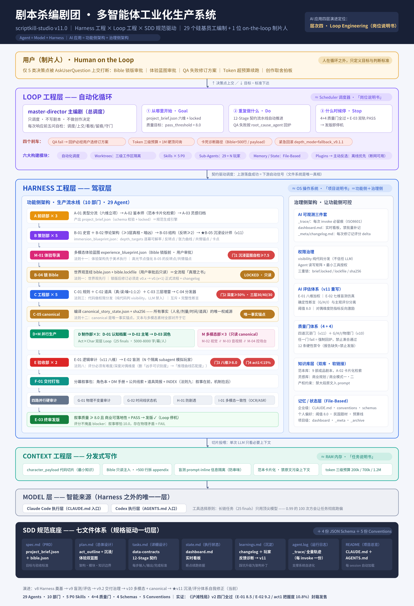
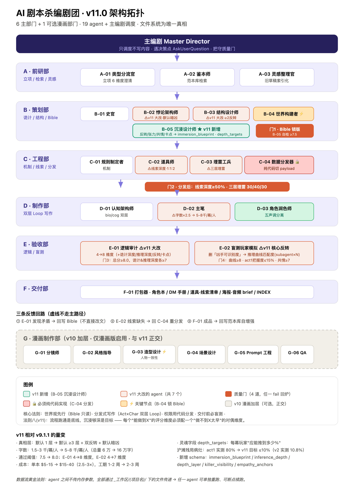
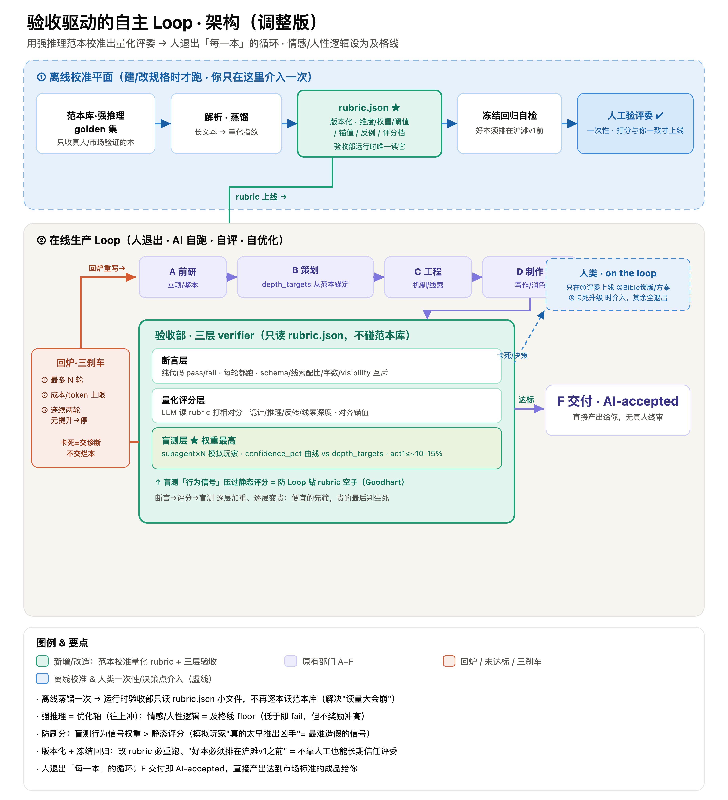

# 剧本杀编剧 Multi-Agent（Jubensha Multi-Agent）

> 用 29 个 AI agent 组成的"编剧团"，工业化生产线下剧本杀（谋杀之谜）剧本。
> 基于 Claude Code / Codex 的多 agent 协作框架，v11.0 沉浸升级版。



## 这是什么

这是一套完整的**剧本杀创作流水线**：你只需要告诉"主编剧"想开一个什么样的本（题材、人数、时长），它会按依赖顺序调度 29 个专业 agent，从选题、诡计设计、世界观、角色本写作，到逻辑审计、盲测试玩、交付打包，全流程自动协作完成，并通过多道质量门保证成品质量。

## 编剧团构成（29 个 agent）

| 部门 | agent | 职责 |
|------|-------|------|
| A 选题部 | A-01 题材路由 / A-02 参考策展 / A-03 灵感归档 | 定方向、找参考 |
| B 架构部 | B-01 史官 / B-02 诡计架构师 / B-03 结构设计师 / B-04 世界观 / B-05 沉浸设计师 | 核心诡计与故事骨架 |
| C 机制部 | C-01 规则 / C-02 道具 / C-03 细节注入 / C-04 线索分发 / C-05 正史状态编译 | 线索与游戏机制 |
| D 写作部 | D-01 身份架构 / D-02 主笔 / D-03 语感区分 | 角色本正文 |
| E 质检部 | E-01 逻辑审计 / E-02 盲测试玩 / E-03 交付审计 | 质量把关 |
| F 交付部 | F-01 交付打包 | 成品输出 |
| G 校验部 | G-01 不变量审计 / G-02 时间线状态机 | 物理一致性 |
| H 防剧透 | H-01 剧透检查 | 信息隔离 |
| I 多模态审计 | I-01 多模态审计 | 图文一致性 |
| M 多模态部 | M-01 体验总监 / M-02 视觉 / M-03 音视频 / M-04 互动构建 | 沉浸体验物料 |

调度中枢：**master-director（主编剧）**——不写剧本，只做调度和决策上报。



## v11.0 四道沉浸质量门

1. Bible 锁版前：沉浸蓝图生成 + B-05 自检 ≥ 7.5
2. 线索分发后：推理深度 ≥ 1 的线索占比 ≥ 50%，细节三层 30/40/30
3. E-01 完工：8 维度总分 ≥ 8.0，诡计/推理深度每项 ≥ 7
4. E-02 完工：推理曲线匹配度 ≥ 8，第一幕平均把握度 ≤ 15%，玩家共情度 ≥ 7



## 目录结构

```
.claude/agents/     29 个 agent 的完整 system prompt（核心）
.claude/skills/     配套 skill（分发器、盲测器、世界观等）
.agents/ .codex/    Codex 等其他客户端的适配副本
architecture/       v11.0 沉浸升级设计文档
conventions/        评分标准、数据契约、命名规范、看板模板
schemas/            bible / 角色 / 项目简报等 JSON Schema
CLAUDE.md           Claude Code 入口说明（每个 session 自动读取）
AGENTS.md           Codex 入口说明
```

## 怎么用

1. 安装 [Claude Code](https://docs.claude.com/en/docs/claude-code)（或 Codex）
2. 把本仓库克隆到本地，在仓库目录启动 Claude Code
3. 对主编剧说：`开新本：民国背景，6 人，硬核推理，时长 5 小时`
4. 按看板提示逐阶段推进，质量门不过会自动打回修订

> 注意：仓库只包含编剧团系统本身，不含任何成品剧本或第三方版权内容。

## 许可证

[CC BY-NC-SA 4.0](LICENSE)：允许转载、修改，但必须署名、**禁止商用**、二创需以相同方式共享。商业授权请联系作者。

## 作者

于金平
